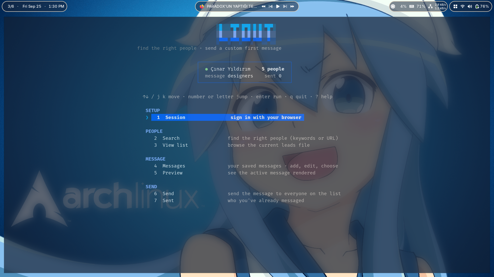

# liout

Send a custom first message to the right people on LinkedIn, from one terminal UI. It drives a real Chrome/Firefox through Playwright and uses your own logged in session (no password, no API token).

<p align="center"></p>

## Install

Requires Go 1.25+.

```bash
git clone https://github.com/codeyevsky/liout.git
cd liout
go build -o liout ./cmd/liout
./liout
```

Everything lives in this one folder: the `liout` binary plus its data (`config.json`, `messages/`, `data/`, `session.json`) are created here on first run. First run also downloads the Playwright browser once if needed.

## Use

Everything is in the menu (`↑↓`/`jk` move, number/letter jump, `enter` run, `q` quit):

- **Session** · sign in via a real browser (login sticks between runs).
- **Search** · find people by keyword, across everyone or just your connections; each search is saved.
- **View list** · open a saved search; remove people you don't want.
- **Messages** · your local message templates. Write plain text with placeholders:
  `[name]` `[company]` `[title]` `[headline]` `[location]` `[about]`,
  `[spin Hi|Hey|Hello]` (varies per person), `[company|our team]` (custom fallback).
  Anything in a `/* ... */` block is a note and isn't sent.
- **Preview** · render the active message for everyone, paged.
- **Send** · message everyone on a saved search in a visible browser. Skips anyone you've already talked to, never messages twice, small random delay, respects `blacklist.txt`. Falls back to a connection request with a note when direct messaging isn't available.
- **Sent** · a 3×10 grid of who you've messaged; `d` removes an entry.

## Note

LinkedIn restricts automated access and bulk messaging in its Terms of Service. The account risk is yours. Keep lists small and relevant.
